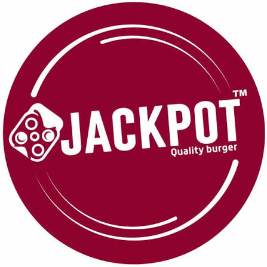

<div align="center">

  

  # Jackpot — The Foodie Standard
  **Dhaka's #1 Certified 100% Halal Burger Chain Website**

  [](https://react.dev/)
  [](https://vite.dev/)
  [](https://tailwindcss.com/)
  [](https://oxc.rs/)

</div>

---

## Table of Contents

- [Overview](#overview)
- [Features](#features)
- [Tech Stack](#tech-stack)
- [Project Structure](#project-structure)
- [Getting Started](#getting-started)
  - [Prerequisites](#prerequisites)
  - [Installation](#installation)
  - [Development Server](#development-server)
  - [Production Build](#production-build)
  - [Linting](#linting)
- [Deployment](#deployment)
- [Design System & Branding](#design-system--branding)
- [License](#license)
- [Credits](#credits)

---

## Overview

**Jackpot** is a high-performance, modern single-page web experience for the Jackpot Burger Chain in Dhaka, Bangladesh. Built with **React 19**, **Vite 8**, and **Tailwind CSS v4**, the application pairs an industrial dark-diner aesthetic with an Apple-style scroll-driven canvas sequence that smoothly reveals the signature handcrafted burger as the user scrolls.

The application incorporates a complete, authentic visual system originally crafted in Google Stitch, delivering seamless navigation across the Demra and Jatrabari corridor branches, full menu showcases, customer testimonials, and direct Foodpanda delivery integration.

---

## Features

- **Apple-Style Scroll-Driven Sequence**:
  - Automatically loads and sorts all 300 high-definition frames from `src/animation/Gourmet_burger_frame/`.
  - Pinned full-viewport sticky `<canvas>` container with `object-fit: cover` geometry and Retina/High-DPI (`devicePixelRatio`) scaling.
  - Throttled canvas rendering powered by `requestAnimationFrame` (redraws only when the frame index changes).
  - Preloads all frames into memory before playback with an interactive progress counter and loading bar.

- **Dynamic Brand Reveal Overlay**:
  - Smooth payoff moment revealing **JACKPOT — THE FOODIE STANDARD** during the final 20% of the scroll sequence.
  - Interpolates opacity, scale (`0.92 → 1.0`), and vertical elevation (`translate3d`) tied directly to normalized scroll progress.
  - Styled with ambient Deep Crimson (`#A81326`) multi-stage glow and frosted glass pill badges.

- **Mobile-Responsive Sticky Navigation**:
  - Persistent blurred frosted glass header (`backdrop-blur-md z-50`).
  - Adaptive Foodpanda CTA button that comfortably scales on compact viewports.
  - Full-screen animated mobile drawer menu with direct section navigation and hotline dialing.
  - Native smooth scrolling with navbar offset compensation (`scroll-padding-top: 5rem`).

- **Authentic Google Stitch Website Architecture**:
  - **Hero Section**: High-impact typography, trust pills, dual CTAs, verified stats bar, and signature burger product card.
  - **Halal Trust Strip**: 4 core quality pillars (100% Halal Meat, Fresh Never Frozen, Made to Order, Fast Hot Delivery).
  - **Brand Story (About)**: Narrative outlining the brand's neighborhood roots in the bustling South Dhaka corridor.
  - **Menu Highlights**: 6 signature items (*Chicken Burger*, *Chicken Cheese*, *Crispy Chicken*, *Oreo Shake*, *Royal Beef*, *BBQ Spicy Wings*) + high-resolution restaurant menu board viewer with click-to-enlarge support.
  - **Our Branches**: Operational hours, addresses, hotlines, and Google Maps directions for Shonir Akhra, Konapara, and Demra Staff Quarter outlets.
  - **Customer Reviews**: Testimonials and 4.8★ rating showcase.
  - **Ambiance Gallery**: 4-photo bento grid capturing live griddle sizzles and diner entrances.
  - **Footer**: Corridor branch directory, operational hours, social channels, and Halal compliance statement.

- **Production-Grade Build Pipeline**:
  - Native build-time compilation via `@tailwindcss/vite` for tree-shaking and JIT caching (no runtime CDN overhead).
  - Ultra-fast static asset bundling with zero lint warnings via `oxlint`.

---

## Tech Stack

| Technology | Version | Purpose |
| :--- | :--- | :--- |
| **[React](https://react.dev/)** | `^19.2.8` | UI library & component lifecycle |
| **[Vite](https://vite.dev/)** | `^8.2.2` | Build tool, HMR dev server & bundler |
| **[Tailwind CSS](https://tailwindcss.com/)** | `^4.3.3` | Utility-first styling & design token engine |
| **[@tailwindcss/vite](https://tailwindcss.com/)** | `^4.3.3` | First-class Vite plugin for Tailwind v4 JIT compilation |
| **[PostCSS](https://postcss.org/)** | `^8.5.28` | CSS transformation & autoprefixing |
| **[Autoprefixer](https://github.com/postcss/autoprefixer)** | `^10.5.4` | Vendor prefix automation |
| **[Oxlint](https://oxc.rs/)** | `^1.79.0` | High-speed Rust-based JavaScript/JSX linter |

---

## Project Structure

```text
jackpot/
├── public/
│   ├── Restaurant_menu.jpeg      # High-resolution printable menu board
│   └── favicon.jpg               # Brand favicon & touch icon
├── src/
│   ├── animation/
│   │   ├── Gourmet_burger_frame/ # 300 JPG sequential burger frames (001 to 300)
│   │   └── frames.js             # Vite glob loader & natural numerical sorter
│   ├── assets/
│   │   └── hero.png              # Starter visual asset
│   ├── components/
│   │   ├── sections/             # Modular section components
│   │   │   ├── AboutSection.jsx          # Neighborhood roots, story & key stats
│   │   │   ├── BranchesSection.jsx       # Shonir Akhra, Konapara & Staff Quarter hubs
│   │   │   ├── FoodpandaPromoSection.jsx # Doorstep delivery promotional strip
│   │   │   ├── GallerySection.jsx        # 4-photo bento grid & halal guarantee bar
│   │   │   ├── HalalPromiseSection.jsx   # 4 core quality pillars
│   │   │   ├── HeroSection.jsx           # Headline, CTAs, stats & product card
│   │   │   ├── MenuHighlightsSection.jsx # 6 product cards & menu board showcase
│   │   │   ├── ReviewsSection.jsx        # Customer reviews & 4.8★ rating display
│   │   │   └── index.js                  # Sections barrel export
│   │   ├── Footer.jsx            # Full brand footer, hours & legal links
│   │   ├── Navbar.jsx            # Responsive sticky navbar + mobile drawer
│   │   ├── ScrollFrameAnimation.jsx      # Canvas sequence player & brand reveal
│   │   ├── ScrollFrameAnimation.css      # Animation wrapper & overlay styles
│   │   └── index.js              # Top-level components barrel export
│   ├── App.jsx                   # Concise main layout orchestrator
│   ├── index.css                 # Tailwind v4 theme tokens, fonts & base resets
│   └── main.jsx                  # React DOM root mounting
├── index.html                    # HTML shell, Google Fonts & viewport setup
├── package.json                  # Dependencies, scripts & metadata
├── package-lock.json             # NPM dependency lockfile
├── tailwind.config.js            # Custom design tokens (colors, spacing, fonts)
└── vite.config.js                # Vite configuration with React & Tailwind plugins
```

---

## Getting Started

### Prerequisites

- **Node.js**: v18.0.0 or higher (v20+ recommended)
- **NPM**: v9.0.0 or higher

### Installation

1. Clone the repository:
   ```bash
   git clone https://github.com/Smswad/jackpot.git
   cd jackpot
   ```

2. Install dependencies:
   ```bash
   npm install
   ```

### Development Server

Start the local Vite development server with Hot Module Replacement (HMR):

```bash
npm run dev
```

Open [http://localhost:5173](http://localhost:5173) in your browser.

### Production Build

Compile and optimize all assets into the `dist/` directory:

```bash
npm run build
```

To preview the production build locally:

```bash
npm run preview
```

### Linting

Run Oxlint to check code quality and verify JSX rules:

```bash
npm run lint
```

---

## Deployment

The project is optimized for zero-config deployment on platforms such as **Vercel**, **Netlify**, or **Cloudflare Pages**:

### Deploying to Vercel

1. Push your code to GitHub (`main` or `master` branch).
2. Import the repository into your [Vercel Dashboard](https://vercel.com/new).
3. Vercel will automatically detect **Vite**:
   - **Framework Preset**: `Vite`
   - **Build Command**: `npm run build`
   - **Output Directory**: `dist`
   - **Install Command**: `npm install`
4. Click **Deploy**.

---

## Design System & Branding

- **Brand Palette**:
  - Primary Crimson: `#A81326` (Container) / `#FFB3B0` (Text/Accent)
  - Golden Amber: `#F59E0B` / `#EE9800` (Pricing & Ratings)
  - Dark Neutrals: `#131315` (Canvas Background), `#0E0E10` (Deep Surfaces), `#201F21` (Card Surfaces)
- **Typography**:
  - Headlines & Accents: **Oswald** (Google Fonts)
  - Body Copy & Navigation: **Plus Jakarta Sans** (Google Fonts)
- **Iconography**:
  - Google **Material Symbols Outlined**

---

## License

This repository does not currently include an open-source license. All proprietary brand assets, logos, photography, and menu designs remain the property of Jackpot Quality Burger.

---

## Credits

- **Jackpot Quality Burger** — South Dhaka Corridor (Shonir Akhra • Konapara • Demra Staff Quarter)
- Designed with **Google Stitch**
- Developed by **Smswad**
